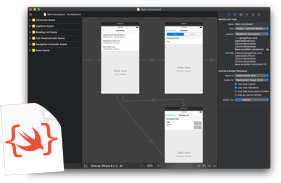

# StoryboardModel

[](https://opensource.org/licenses/MIT)



**StoryboardModel** is a framework that includes the storyboard XML models supporting Codable protocol.
This library is a part of the [storyboard2code](https://github.com/watanabetoshinori/storyboard2code) commandline tool.

- [Getting Started](#getting-started)
    - [Requirements](#requirements)
    - [Installation](#installation)
- [Usage](#usage)
    - [Initialization](#initialization)
- [Author](#author)
- [License](#license)

## Getting Started

### Requirements

* iOS 12.0+
* Xcode 10.0+
* Swift 4.2+

### Installation

**[Swift Package Manager](https://github.com/apple/swift-package-manager)**

```swift
dependencies: [
	.package(url: "https://github.com/watanabetoshinori/StoryboardModel.git", from: "0.0.1"),
],
targets: [
    .target(
        ...
        dependencies: ["StoryboardModel"]),
]
```

## Usage

### Initialization

Start by importing the package in the file you want to use it.

```swift
import StoryboardModel
```

## Author

Watanabe Toshinori – toshinori_watanabe@tiny.blue

## License

This project is licensed under the MIT License. See the [LICENSE](LICENSE) file for details.
